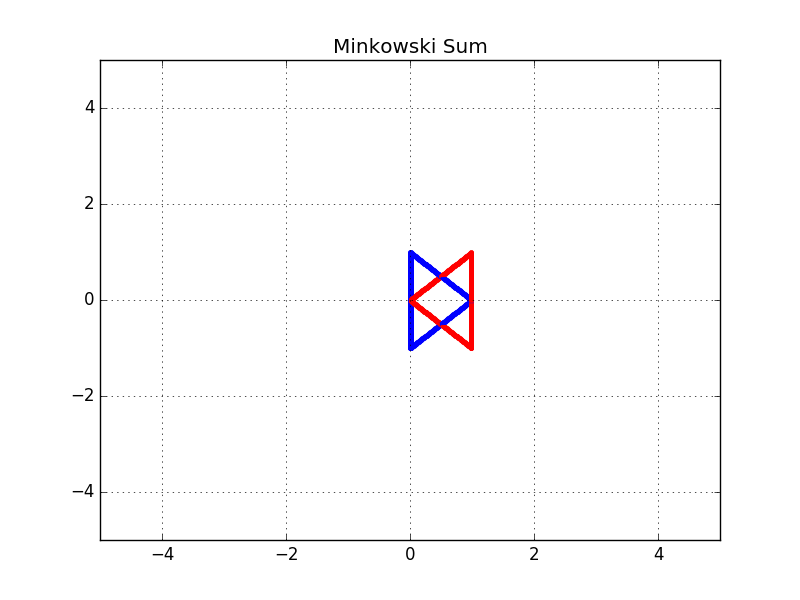

[](https://www.udacity.com/robotics)

# RoboND-MinkowskiSum
Inflate any obstacle and generate its configuration space using the Minkowski Sum.

### Example
Generating the configuration space of the blue Robot and red Obstacle


### Compiling
```sh
$ cd /home/workspace/
$ git clone https://github.com/udacity/RoboND-MinkowskiSum
$ cd RoboND-MinkowskiSum/
$ g++ minkowski_sum.cpp -o app -std=c++11 -I/usr/include/python2.7 -lpython2.7
```

### Running
```sh
$ ./app
```
Ignore the matplotlib error 

### Generated Configuration Space
This program will first translate the blue robot position to the red obstacle, generate the green configuration space of the blue robot and red obstacle, and translate it to the red obstacle position as follows:


